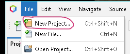

# CFGS Desarrollo de Aplicaciones Web


- [CFGS Desarrollo de Aplicaciones Web](#cfgs-desarrollo-de-aplicaciones-web)
  - [1. Entorno de Desarrollo](#1-entorno-de-desarrollo)
    - [1.1 Ubuntu Server 24.04.3 LTS](#11-ubuntu-server-24043-lts)
      - [1.1.1 **Configuración inicial**](#111-configuración-inicial)
        - [Nombre y configuraicón de red](#nombre-y-configuraicón-de-red)
        - [**Actualizar el sistema**](#actualizar-el-sistema)
        - [**Configuración fecha y hora**](#configuración-fecha-y-hora)
        - [**Cuentas administradoras**](#cuentas-administradoras)
        - [**Habilitar cortafuegos**](#habilitar-cortafuegos)
      - [1.1.2 Instalación del servidor web](#112-instalación-del-servidor-web)
        - [Instalación](#instalación)
        - [Verficación del servicio](#verficación-del-servicio)
        - [Virtual Hosts](#virtual-hosts)
        - [Permisos y usuarios](#permisos-y-usuarios)
      - [1.1.3 PHP](#113-php)
      - [1.1.4 MySQL](#114-mysql)
      - [1.1.5 XDebug](#115-xdebug)
      - [1.1.6 DNS](#116-dns)
      - [1.1.7 SFTP](#117-sftp)
      - [1.1.8 Apache Tomcat](#118-apache-tomcat)
      - [1.1.9 LDAP](#119-ldap)
    - [1.2 Windows 11](#12-windows-11)
      - [1.2.1 **Configuración inicial**](#121-configuración-inicial)
        - [**Nombre y configuración de red**](#nombre-y-configuración-de-red)
        - [**Cuentas administradoras**](#cuentas-administradoras-1)
      - [1.2.2 **Navegadores**](#122-navegadores)
      - [1.2.3 **MobaXterm**](#123-mobaxterm)
      - [1.2.4 **Netbeans**](#124-netbeans)
      - [1.2.5 **Visual Studio Code**](#125-visual-studio-code)
  - [2. GitHub](#2-github)
  - [3.Entorno de Explotación](#3entorno-de-explotación)

|  DAW/DWES Tema2 |
|:-----------:|
||
| INSTALACIÓN, CONFIGURACIÓN Y DOCUMENTACIÓN DE ENTORNO DE DESARROLLO Y DEL ENTORNO DE EXPLOTACIÓN |

## 1. Entorno de Desarrollo

### 1.1 Ubuntu Server 24.04.3 LTS

Este documento es una guía detallada del proceso de instalación y configuración de un servidor de aplicaciones en Ubuntu Server utilizando Apache, con soporte PHP y MySQL

#### 1.1.1 **Configuración inicial**

##### Nombre y configuraicón de red

> **Nombre de la máquina**: daw-used\
> **Memoria RAM**: 2G\
> **Particiones**: 150G(/) y resto (/var)\
> **Configuración de red interface**: xxxx \
> **Dirección IP** :xx.xx.xx.xx/22\
> **GW**: xx.xx.xx.xx/22\
> **DNS**: xx.xx.xx.xx

Editar el fichero de configuración del interface de red  **/etc/netplan**,

```bash

# This is the network config written by 'subiquity'
network:
  ethernets:
    enp0s3:
      addresses:
       - 10.199.10.49/22
      nameservers:
         addresses:
         - 10.151.123.21
         - 10.151.126.21
      routes:
          - to: default
             via: 10.199.8.1
         search: [educa.jcyl.es]
  version: 2
````

##### **Actualizar el sistema**

```bash
sudo apt update
sudo apt upgrade
```

##### **Configuración fecha y hora**

[Establecer fecha, hora y zona horaria](https://somebooks.es/establecer-la-fecha-hora-y-zona-horaria-en-la-terminal-de-ubuntu-20-04-lts/ "Cambiar fecha y hora")

##### **Cuentas administradoras**

> - [X] root(inicio)
> - [X] miadmin/paso
> - [X] miadmin2/paso

##### **Habilitar cortafuegos**

como activar cortafuegos
```bash
sudo ufw enable
```

#### 1.1.2 Instalación del servidor web

##### Instalación
Descargar la iso de Ubuntu Server en la página (Server install image) : https://releases.ubuntu.com/noble/

Para saber que sistema operativo se tiene.
```bash
uname -a
```
Crear el servidor en la maquina virtual con los datos de configuración configurando la red de la maquina en adaptador puente y instalar el servidor siguiendo la configuración.
<!-- https://markdown.es/sintaxis-markdown/-->

* Cuando esté instalado, se actualiza.
```bash
sudo apt update
```
```bash
sudo apt upgrade
```

* Para ver Interfaces de red y sus direcciones IP:
```bash
ip a
```
* Para ver la tabla de enrutamiento.
```bash
ip r
```

* Para ver el nombre de la máquina.
```bash
hostname
```
* Se hace una copia de seguridad del archivo de configuración que se encuentra en /etc/netplan.
```bash
sudo cp 50-cloud-init.yaml 50-cloud-init.yaml.backup
```
* Se cambia el nombre del archivo
```bash
sudo mv 50-cloud-init.yaml enp0s3.yaml
```

* Se comprueban las particiones 
```bash
lsblk
```
o
```bash
df -h
```
* Se aplica la configuración
```bash
sudo netplan apply
```

* Se activa el cortafuego
```bash
sudo ufw enable
```

* Se activa el puerto 22
```bash
sudo ufw allow 22
```
* Para borrar puertos primero hay que saber cual es el numero de proceso de puerto
```bash
sudo ufw status numered
```
* Para borrar un puerto
```bash
sudo ufw delete [num de proceso]
```
* Para ver el status de cortafuergos
```bash
sudo ufw status
```

* Se hace ping del servidor al anfitrion
```bash
sudo ping [IP Anfitrion]
```

* Si hubiera que cambiar la hora del servidor, se haría así
```bash
timedatectl set-timezone Europe/Madrid
```
* Para ver la hora del servidor
```bash
date
```

* Se hace ping del anfitrion al servidor. En el cmd del anfitrion.
```bash
ping [IP servidor]
```

* Para conectarse al servidor desde el anfitrion
```bash
ssh usuario@ipServidor
```

* Para apagar el servidor desde el anfitrion una vez dentro.(0 es el tiempo de espera para apagar)
```bash
sudo shutdown -t 0
```


##### Verficación del servicio

##### Virtual Hosts
##### Permisos y usuarios
* Creación del usuario miadmin2 perteneciente al grupo sudo
```bash
sudo usermod -aG sudo miadmin2
```

* Para ver en que grupo está miadmin2
```bash
cat /etc/group | grep miadmin
```
* Para quitar o poner permisos
* Para saber la carpeta shell de un usuario, por ejemplo miadmin.
```bash
cat /etc/passwd | grep miadmin
```
* Para crear una usuario con una shell concreta
```bash
sudo usermod -s /bin/bash miadmin
```
* Creación del usuario operador web.
    -M → No crear el directorio home (el home será /var/www/html, pero no lo crea).

-d /var/www/html → Establece /var/www/html como directorio home del usuario.

-N → No crea un grupo con el mismo nombre que el usuario.

-g www-data → Asigna el grupo primario www-data.

-s /bin/bash → Asigna la shell Bash.
```bash
sudo useradd -M -d /var/www/html -N -g www-data -s /bin/bash operadorweb
```

#### 1.1.3 PHP
* Actualiza el sistema e instala Apache: 
Abre la terminal en tu servidor Ubuntu y ejecuta los siguientes comandos para actualizar el sistema e instalar Apache. 
```bash
sudo apt update 
```
```bash
sudo apt upgrade -y  
```

* Añade el repositorio PPA de Ondrej para PHP
Instala el paquete software-properties-common si no está instalado y añade el repositorio PPA de Ondrej para obtener versiones recientes de PHP.

```bash
sudo apt install software-properties-common -y
sudo add-apt-repository ppa:ondrej/php -y
```

Para ver si el repositorio se ha instalado correctamente:
```bash
ls /etc/apt/sources.list.d/ | grep ondrej
```

Para actualizar los repositorios después de añadir el PPA:
```bash
sudo apt update
```

* Instala PHP-FPM y módulos de Apache
Instala la versión deseada de PHP (en este ejemplo, PHP 8.3), el módulo de Apache correspondiente para PHP-FPM, y otras extensiones útiles.

```bash
sudo apt install php8.3 libapache2-mod-php8.3 php8.3-fpm -y
```

Configuración del Multi-Processing Module (MPM)
El módulo mpm_prefork y libapache2-mod-php8.3 (mod_php) no pueden funcionar al mismo tiempo que mpm_event y proxy_fcgi (necesario para PHP-FPM). Necesitamos desactivar los primeros.

Se desactiva el módulo mod_php: Esto elimina la dependencia con mpm_prefork.

```bash
sudo a2dismod php8.3
```

Se desactiva mpm_prefork:

```bash
sudo a2dismod mpm_prefork
```

Activa mpm_event y proxy_fcgi: Estos módulos habilitan la comunicación con PHP-FPM.

```bash
sudo a2enmod mpm_event proxy_fcgi
```

* Configura y habilita PHP-FPM para Apache
  
Habilita la configuración de PHP-FPM para Apache.

Bash

sudo a2enconf php8.3-fpm
Reinicia el servidor Apache
Reinicia Apache para aplicar todos los cambios de módulos y configuraciones:

```bash
sudo systemctl restart apache2
```

* Verifica la instalación
Para confirmar que PHP y Apache están funcionando correctamente con PHP-FPM, crea un archivo info.php en el directorio web de Apache y visita esa página en tu navegador.

Se crea el archivo info.php en el directorio /var/www/html:

```bash
sudo nano /var/www/html/info.php
```

Se pega el siguiente código dentro del archivo info.php:

PHP

<?php 
phpinfo();
?>
Se verifica en el navegador accediendo a la IP de tu máquina virtual 

http://IP/info.php

* Modificar Directivas de PHP
Modificar display_errors para mostrar errores y memory_limit para aumentar el limite de memoria de PHP.

Se edita el archivo de configuración de PHP-FPM:

´´´bash
sudo nano /etc/php/8.3/fpm/php.ini
```

Se busca y se cambian los siguientes valores:(Ctrl+W)


display_errors = On
display_startup_errors = On
memory_limit = 256M

Se Reinicia el servicio PHP-FPM para aplicar los cambios:

```bash
sudo systemctl restart php8.3-fpm
```

#### 1.1.4 MySQL
#### 1.1.5 XDebug
#### 1.1.6 DNS
#### 1.1.7 SFTP
#### 1.1.8 Apache Tomcat
#### 1.1.9 LDAP

### 1.2 Windows 11
#### 1.2.1 **Configuración inicial**
##### **Nombre y configuración de red**
##### **Cuentas administradoras**
#### 1.2.2 **Navegadores**
#### 1.2.3 **MobaXterm**
#### 1.2.4 **Netbeans**
* Crear un proyecto PHP en Netbeans
Se hace clic en File -> New Project o se hace clic en el pestaña del cuadrado naranja con un más




En el primer paso de la creación de projyecto, se selecciona PHP en Categories, y PHP Aplicación from Remote Server y se hace clic en Next


En el paso 2 se indica el nombre del proyecto, y la ubicación en local
y se hace clic en Next


En el paso 3 se indica la IP del servidor...


 y se hace clic en Manage...
 para configurar la conexion al servidor remoto, donde se indicará el nombre del servidor, la IP , el puerto, el nombre del usuario con permisos para actuar en las carpetas del proyecto, la contraseña....


 se hace un test de conexión y saldrá un mensaje de confirmación
 
   hacer clic en Yes,  si el test es ok, hacer clic en OK...(el servidor remoto tiene que estar encendido sino no hace la conexion)
  
   se cierra la ventana de conexion se indica la ubicación de la carpeta del proyecto en el servidor y se hace clic en Next en la ventana del paso 3.


Sale de nuevo el mensaje de Confirmación de conexión y se hace clic en Yes.


Se checkea que la carpeta del proyecto tenga todos los elementos necesarios y se hace clic en finish.


Sale de nuevo el mensaje de Confirmación de conexión y se hace clic en Yes.


El proyecto aparecerá en la parte izquierda del IDE.


#### 1.2.5 **Visual Studio Code**


## 2. GitHub
## 3.Entorno de Explotación

---

> Véronique Grué  
> Curso: 2025/2026  
> 2º Curso CFGS Desarrollo de Aplicaciones Web  
> Despliegue de aplicaciones web
